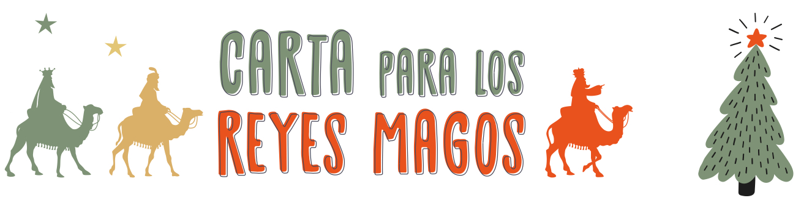

# three-wise-men-letter

High-performance inference of [OpenAI's Whisper](https://github.com/openai/whisper) automatic speech recognition (ASR) model using [whisper.cpp](https://github.com/ggerganov/whisper.cpp.git) for ASR combined with Gemini 1.5 to create letters for the three wise men, MacOS oriented:

## Quick start

First clone the repository:

```bash
git clone https://github.com/igmsalinas/three-wise-men-letter.git
```

Then, download the Whisper model converted in `ggml` format:

```bash
cd whisper.cpp
sh ./models/download-ggml-model.sh large-v3-turbo-q5_0
```

Now build the main example:

```bash
# build the main example
make
```

In MacOS, navigate to the App Store and install XCode:

https://apps.apple.com/es/app/xcode/id497799835?l=en-GB&mt=12

Now create the metal ggml configuration needed:

```bash
cd ./ggml/src
# use xcode to create the metal air ggml config
xcrun -sdk macosx metal    -O3 -c ggml-metal.metal -o ggml-metal.air
xcrun -sdk macosx metallib        ggml-metal.air   -o default.metallib
```

Obtain a free API key from Google to execute Gemini 1.5:

https://ai.google.dev

Create a `.env` file inside the parent directory `./three-wise-men/.env containing the following information.

First:

```bash
# navigate to the parent dir and create .env file
cd -
cd ..
touch .env
```

Then add the following to the created `.env`:

```text
GOOGLE_API_KEY=<YOUR_API_KEY>
TOKENIZERS_PARALLELISM=false
```

Create a new virtual environment and install the requirements:

```bash
python -m venv .venv
source .venv/bin/activate
pip install -r requirements.txt
```

Now you are set up to trying the demo! Just execute the `app.py` with Python:

```bash
python app.py
```
